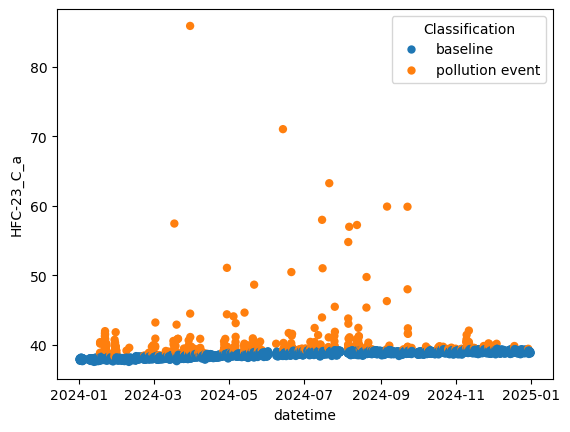

### About

The module is able to classify between baseline and pollution events, depending on the limit set by user. 

### Installation

```
pip install -e git+https://github.com/AtmosphericAngels/IAU_baseline.git
```

### Usage

`IAU_baseline` is easy to use. Import the module:
```
import IAU_baseline.baseline as base
```
Depending on your data you need to adjust the time values to either datetime format or fractionaltime. <br>
`x_val`, `y_val` and `y_err` need to be lists. 

```
base.find_ol(func=base.fct.higher, x_val = datetime, y_val = mole_fraction, y_err = stdev_of_molefraction , flag= None)
```

### Example


